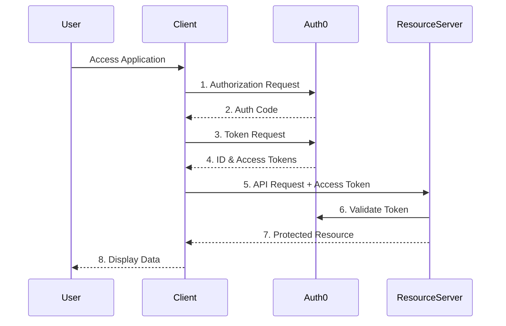

# OAuth2 Demo Project

This project demonstrates a complete OAuth2 authentication and authorization flow using Spring Boot and Auth0. It consists of two separate applications that work together to showcase secure authentication and API access.

## Project Structure

The demo consists of two main components:

1. **client-demo**: A Spring Boot web application that acts as an OAuth2 client
2. **resource-server-demo**: A Spring Boot application that serves as a protected API (OAuth2 resource server)

## Features

### Client Demo

- OAuth2 authentication with Auth0
- OpenID Connect integration
- Protected web pages
- User profile information display
- Secure API calls with token forwarding
- Thymeleaf-based web interface

### Resource Server Demo

- OAuth2 JWT token validation
- Role-based access control (RBAC)
- Protected API endpoints
- Custom role conversion from Auth0 claims
- Bearer token authentication

## Tech Stack

- Java 21
- Spring Boot 3.4.4
- Spring Security
- Spring Security OAuth2 Client/Resource Server
- Thymeleaf (for client UI)
- Auth0 as Identity Provider

## Prerequisites

1. Java 21 or higher
2. Maven (or use the included Maven wrapper)
3. Auth0 account with configured:
   - Regular Web Application (for client)
   - API (for resource server)

## Getting Started

### 1. Auth0 Setup

#### For Client Application:

- Create a new Regular Web Application in Auth0
- Configure callback URL: `http://localhost:8080/login/oauth2/code/auth0`
- Configure logout URL: `http://localhost:8080/`

#### For Resource Server:

- Create a new API in Auth0
- Set the identifier as: `https://resource-server-demo-api-v1`
- Enable RBAC and create necessary roles

### 2. Configuration

#### Client Demo (runs on port 8080):

```yaml
spring:
  security:
    oauth2:
      client:
        registration:
          auth0:
            client-id: YOUR_CLIENT_ID
            client-secret: YOUR_CLIENT_SECRET
            scope:
              - openid
              - profile
              - email
```

#### Resource Server (runs on port 8081):

```yaml
spring:
  security:
    oauth2:
      resource-server:
        jwt:
          issuer-uri: YOUR_AUTH0_DOMAIN
```

### 3. Running the Applications

Start both applications using Maven:

```bash
# Start the resource server
cd resource-server-demo
./mvnw spring-boot:run

# In a new terminal, start the client
cd client-demo
./mvnw spring-boot:run
```

## Testing the Flow

1. Access the client application at `http://localhost:8080`
2. Click "Login with Auth0"
3. After successful authentication, you can:
   - View your profile information
   - Access protected pages
   - Make calls to the protected API

## Documentation

Each application contains detailed documentation in its respective `docs` folder:

- `client-demo/docs/`: Documentation for the OAuth2 client implementation
- `resource-server-demo/docs/`: Documentation for the OAuth2 resource server implementation

## Architecture



## Security Considerations

- All sensitive configuration should be externalized
- Use HTTPS in production
- Properly configure CORS settings
- Implement proper error handling
- Enable appropriate logging
- Set up rate limiting for production use

## Contributing

Feel free to submit issues and enhancement requests.

## License

This project is meant for educational purposes and comes with no specific license.
