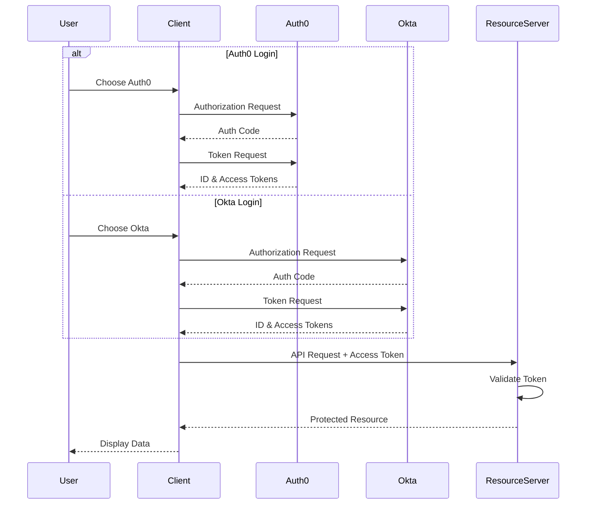

# Multi-Provider OAuth2 Authentication 🔑

A comprehensive OAuth2 demonstration using Spring Boot with multiple identity providers (Auth0 and Okta). The project consists of two applications working together to showcase authentication, authorization, and secure API access.

## Project Components 🔧

1. **[OAuth2 Client](client-demo/docs/overview.md)** 🖥️: Web application demonstrating multi-provider authentication
2. **[Resource Server](resource-server-demo/docs/overview.md)** 🛡️: Protected API with multi-tenant JWT validation

## Key Features ✨

- Multi-provider authentication (Auth0 and Okta) 🔐
- Role-based access control (RBAC) 👥
- Custom role conversion from provider claims 🔄
- Protected API endpoints with JWT validation ✅
- Thymeleaf-based web interface 🎨

## Quick Start 🎯

1. Prerequisites:

   - Java 21 or higher ☕
   - Maven (or use included wrapper) 🔨
   - Auth0 and Okta accounts 🔑

2. Setup & Configuration:

   - [Client Setup Guide](client-demo/docs/getting-started.md) 💻
   - [Resource Server Setup Guide](resource-server-demo/docs/getting-started.md) 🔒

3. Run the applications:

```bash
# Start the resource server
cd resource-server-demo
./mvnw spring-boot:run

# In a new terminal, start the client
cd client-demo
./mvnw spring-boot:run
```

## Documentation 📚

- **Client Application**

  - [Overview](client-demo/docs/overview.md) 📋
  - [Configuration Guide](client-demo/docs/configuration.md) ⚙️
  - [Authentication Flow](client-demo/docs/authentication-flow.md) 🔄
  - [API Reference](client-demo/docs/api-reference.md) 📝

- **Resource Server**
  - [Overview](resource-server-demo/docs/overview.md) 📋
  - [Configuration Guide](resource-server-demo/docs/configuration.md) ⚙️
  - [Authentication Flow](resource-server-demo/docs/authentication-flow.md) 🔄
  - [API Reference](resource-server-demo/docs/api-reference.md) 📝

## Testing the Flow 🧪

1. Access the client application at `http://localhost:8080`
2. Choose to login with either Auth0 or Okta
3. After successful authentication, you can:
   - View your profile information 👤
   - Access protected pages 🔒
   - Make calls to the protected API 🔑

## Architecture 🏗️



## Security Considerations 🔐

- All sensitive configuration should be externalized 🔒
- Use HTTPS in production 🌐
- Properly configure CORS settings ⚡
- Implement proper error handling ⚠️
- Enable appropriate logging 📝
- Set up rate limiting for production use 🚦
- Configure proper role mappings for each provider 👥
- Validate token audiences and scopes ✅
- Implement proper session management ⏱️

## License ⚖️

This project is meant for educational purposes and comes with no specific license.
