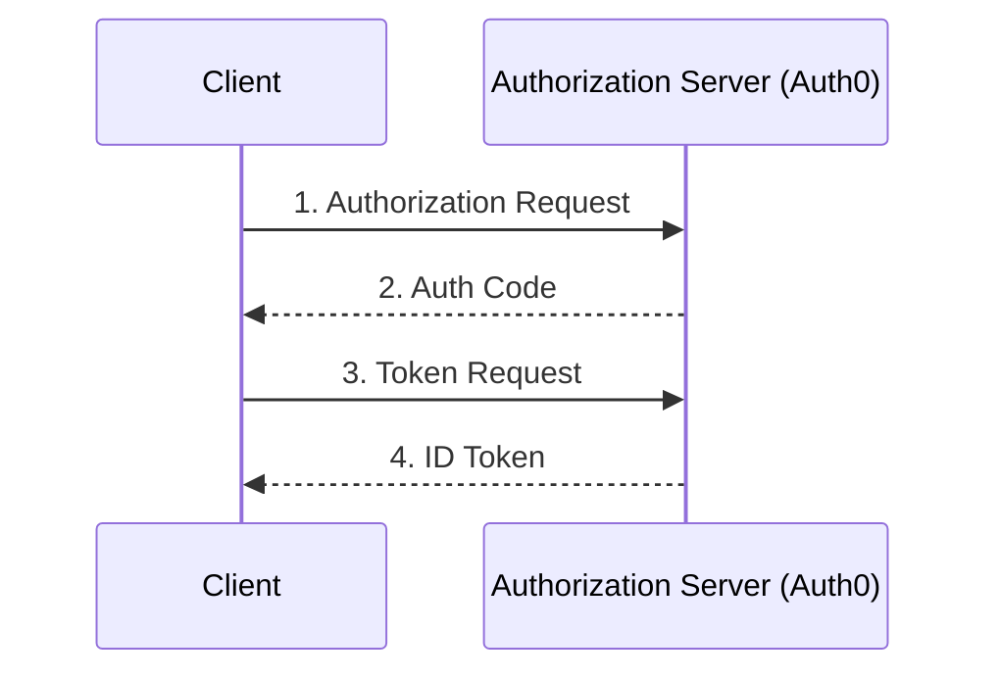

# Authentication Flow

## Overview

This application implements the OAuth2 Authorization Code flow with OpenID Connect (OIDC) using Auth0 as the identity provider.

## Flow Diagram

## Detailed Flow Steps

1. **Initial Request**

   - User clicks "Login with Auth0"
   - Application redirects to Auth0 with required parameters:
     - client_id
     - redirect_uri
     - scope (openid, profile, email)
     - audience (for API access)

2. **Authorization**

   - User authenticates with Auth0
   - Auth0 redirects back with authorization code

3. **Token Exchange**

   - Application exchanges code for tokens
   - Tokens include:
     - Access token (for API calls)
     - ID token (user information)
     - Refresh token (optional)

4. **Session Management**
   - Spring Security creates user session
   - User information extracted from ID token
   - Access token stored for API calls

## Implementation Details

### Security Configuration

The `SecurityConfig` class configures:

- Protected endpoints
- OAuth2 login
- Custom authorization request resolver
- Audience parameter for API access

### Token Handling

`HomeController` demonstrates:

- Accessing user information from ID token
- Using access token for API calls
- Sending user context in API requests

### Session Attributes

Available user information:

- Full name
- Email
- Additional claims from ID token
- Access token for API calls
