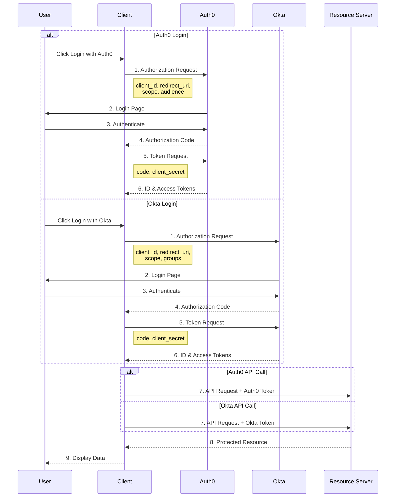

# Authentication Flow 🔄

## Overview 🎯

This application implements OAuth2 client authentication flow with OpenID Connect (OIDC) supporting multiple providers (Auth0 and Okta).

## Flow Diagram 📊

## Authentication Steps 📝

1. **Initial Request** 🚀

   - User clicks either "Login with Auth0" or "Login with Okta" 🔐
   - Application redirects to chosen provider with required parameters:
     - client_id 🆔
     - redirect_uri 🔄
     - scope (openid, profile, email) 📋
     - Additional scopes:
       - Auth0: audience (for API access) 🎯
       - Okta: groups (for role mapping) 👥

2. **Authorization** ✅

   - User authenticates with the chosen provider 🔑
   - Provider redirects back with authorization code 📝

3. **Token Exchange** 🔄

   - Application exchanges code for tokens 🎫
   - Tokens include:
     - Access token (for API calls) 🔑
     - ID token (user information) 👤
     - Refresh token (optional) 🔄

4. **Session Management** ⚙️
   - Spring Security creates user session 📝
   - User information extracted from ID token 👤
   - Access token stored for API calls 🔑

## Implementation Details 🛠️

### Security Configuration 🔒

The `SecurityConfig` class configures:

- Protected endpoints 🛡️
- OAuth2 login 🔐
- Custom authorization request resolver 🔍
- Audience parameter for API access 🎯

### Token Handling 🎫

`HomeController` demonstrates:

- Accessing user information from ID token 👤
- Using access token for API calls 🔑
- Sending user context in API requests 📨

### Session Attributes 📝

Available user information:

- Full name 👤
- Email 📧
- Additional claims from ID token 📋
- Access token for API calls 🔑
