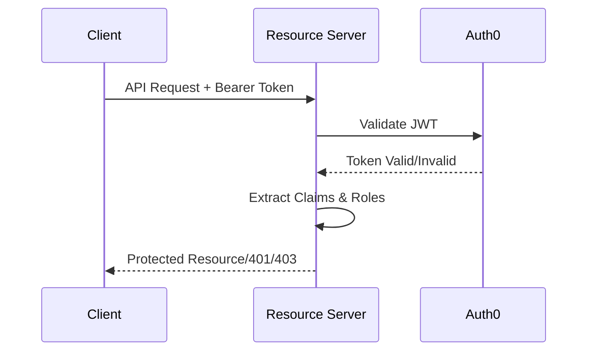

# Authentication Flow

## Overview

This application implements JWT token validation for OAuth2 resource server using Auth0 as the identity provider.

## Flow Diagram

## Detailed Flow Steps

1. **Token Validation**

   - Client sends request with Bearer token
   - Resource server validates JWT signature and claims
   - Checks token expiration and issuer
   - Validates audience claim

2. **Role Processing**

   - Extract custom role claims from JWT
   - Convert Auth0 roles to Spring authorities
   - Apply role-based access control

3. **Request Processing**

   - Validate required headers (X-User-Email)
   - Check endpoint-specific permissions
   - Process the request if authorized

4. **Response Handling**
   - Return protected resource for authorized requests
   - Return 401 for invalid/expired tokens
   - Return 403 for insufficient permissions

## Implementation Details

### JWT Validation

The application validates:

- Token signature using Auth0's public key
- Token expiration
- Token issuer
- Required claims

### Role-Based Security

Implemented through:

- Custom Auth0RoleConverter
- Role-specific endpoint protection
- Spring Security configuration

### Error Handling

Common scenarios:

- Invalid token format
- Expired tokens
- Missing required roles
- Missing required headers
